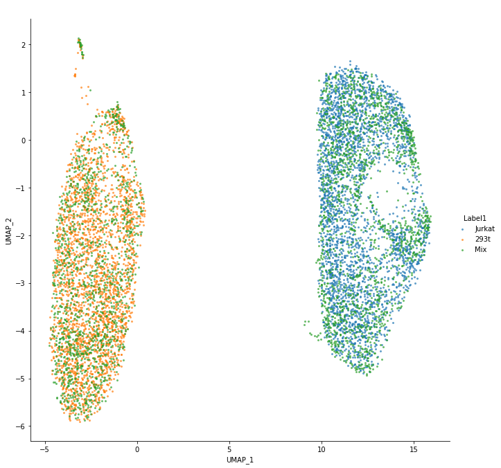
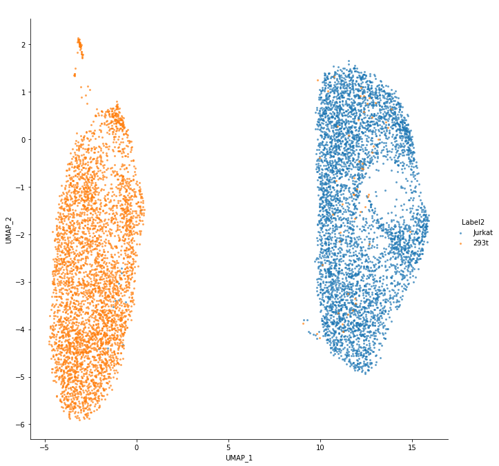

# iMAP Tutorial 

## 1. Installation

### 1.1 Prerequisites

<ul>
    <li>Install Python >= 3.6. Typically, you should use the Linux system and install a newest version of <a href='https://www.anaconda.com/'>Anaconda</a> or <a href = 'https://docs.conda.io/en/latest/miniconda.html'> Miniconda </a>.</li>
    <li>Install pytorch >= 1.1.0. To obtain the optimal performance of deep learning-based models, you should have a Nivia GPU and install the appropriate version of CUDA. (We tested with CUDA >= 9.0)</li>
    <li> Install scanpy >= 1.5.1 for pre-processing </li>
    <li>(Optional) Install <a href='https://github.com/slundberg/shap'>SHAP</a> for interpretation.</li>
</ul>

### 1.2 Installation

The functions required for the stage I and II of iMAP could be imported from “imap.stage1” and “imap.stage2”, respectively.

## 2. iMAP workflow

In this tutorial, we will show the entire iMAP pipeline using the 'cell_lines' dataset (See <font color='red'>main text</font>). The total workfow includes: 
<ol>
    <li>Loading and preprocessing data;</li>
    <li>Running the main iMAP two-stage batch effect removal procedure;</li>
    <li>(Optional) Visulizations; </li>
    <li>(Optional) Interpreting the trained model. </li>    
</ol>


```python
#### IMPORT LIBRARY ####
import scanpy as sc
import imap
```

### 2.1 Loading and preprocessing data

The 'cell_lines' dataset is already stored at <a href=''><font color='blue'>'../data/cell_lines.loom'</font></a>. We use the scanpy API to read the file and store as a 'adata' object. Two kinds of metadata were necessary: **'batch'** and **'celltype'**, while the latter was only used for visualizations and interpretations. 


```python
adata = sc.read_loom('../data/cell_lines.loom',sparse=False)  #Load cell line dataset(-> count data). 
# celltype = adata.obs['celltype']
# Save celltype for visualize the results conveniently. (Not necessary for iMAP).
```

**Preprocessing:** 

We provide a simple pre-process procedure as a function `imap.stage1.data_preprocess`. One essential request for the successful running of iMAP stage1&2 is that the input data should be in the form of <font color='blue'>**log-TPM-like (non-negative)**</font>. And `imap.stage1.data_preprocess` function helps you convert <font color='blue'>**count data**</font> to <font color='blue'>**log-TPM-like**</font> and acquire <font color='blue'>**highly variable genes**</font>.

Be default, Scanpy API `scanpy.pp.highly_variable_genes` is used in iMAP to select highly variable genes from each batch to assist in discovering biological variations. We also recommend users preprocess the data in their own way, as long as the data meets iMAP's requirements. The numbers of genes are relatively appropriate at the level of about 2000. However, it is acceptable to test the performance of 1000-4000 under different data. 

#### iMAP Preprocessing Parameters:

`imap.stage1.data_preprocess(adata: sc.AnnData, key: str='batch', n_top_genes: int=2000, flavor: str='seurat_v3', min_genes: int=200, min_cells: int=3) -> sc.AnnData`:

`adata`: Annotated data matrix(`scanpy.AnnData` class) loaded. Count data, annotation of observations adata.obs(batch information must be contined) and variables adata.var as pd.DataFrame. Names of observations(cell names) and variables(gene names) can be accessed via adata.obs_names and adata.var_names, respectively.

`key`: Name of annotation of batch information in adata. Set to 'batch' here.

`n_top_genes`: Number of highly-variable genes to keep. A parameter for `scanpy.pp.highly_varibale_genes`. Set to 2000 here.

`flavor`: Choose the flavor for identifying highly variable genes. For the dispersion based methods in their default workflows, Seurat passes the cutoffs whereas Cell Ranger passes `n_top_genes`. A parameter for `scanpy.pp.highly_varibale_genes`. Set to 'seurat_v3' here.

`min_genes`: Minimum number of genes expressed required for a cell to pass filtering. A parameter for `scanpy.pp.filter_cells`. Set to 200 here.

`min_cells`: Minimum number of cells expressed required for a gene to pass filtering. A parameter for `scanpy.pp.filter_genes`. Set to 3 here.


```python
adata = imap.stage1.data_preprocess(adata, 'batch')  # Preprocess the data.(count data -> log-format data, high-var genes selected)
adata  # Output the basic information of the preprocessed data.
```

#### Other Preprocessing Parameters:

`imap.stage1.custom_data_preprocess(adata: sc.AnnData, key: str='batch', n_top_genes: int=None, n_batch: int=2, flavor: str='seurat', min_genes: int=200, min_cells: int=3) -> sc.AnnData:`

At the time iMAP was being developed, scanpy was an older version that had no control over the `batch_key` and `flavor` parameters for `scanpy.pp.highly_varibale_genes`, and `custom_data_preprocess` is a function designed for highly-variable genes that selected within each batch separately and merged. This function is reserved because the reproduciblity of our article results. This function is cumbersome to use and is not recommended because we have updated the dependent libraries and corresponding functions. The parameters are the same as before, with two differences.

`n_batch`: For all flavors, genes are first sorted by how many batches they are a HVG. Only those genes that are HVG in at least `n_batch` or more batches are selected and merged.

`flavor`: The old version `scanpy.pp.highly_varibale_genes` only has one flavor. Set to 'seurat' as the old version used.

### 2.2 Batch effect removal by iMAP

<font color='blue'>**Stage I - Key tunable hyperparameters:**</font>

`imap.stage1.iMAP_fast(adata, key='batch', n_epochs=150, num_workers=0, lr=0.0005, b1=0.5, b2=0.999, latent_dim=256, n_critic=5, lambda_co=3, lambda_rc=1, seed=8)`

`adata`: Annotated data matrix(`scanpy.AnnData` class) to input the model. An AnnData object adata stores a data matrix adata.X(log-TPM-like single cell transcriptomics data), annotation of observations adata.obs(batch information must be contined) and variables adata.var as pd.DataFrame. Names of observations(cell names) and variables(gene names) can be accessed via adata.obs_names and adata.var_names, respectively.

`key`: Name of annotation of batch information in adata. Set to 'batch' here.

`n_epochs`: Number of epochs (in Stage I) to train the model. **It has a great effect on the results of iMAP.** The number of epochs should be set according to the number of cells in your dataset. For example, 150 epochs is generally fine for around or greater than 10,000 cells. 100 epochs or fewer for fewer than 5,000 cells(i.e. n_epochs was set to 50 for **541 cells** in DC_rm). The number of training epochs could be slightly increased (i.e. n_epochs was set to 200 for Cell lines dataset), to make the model better exploit datasets with subtle heterogeneities.

`lr`: learning rate. Set to 0.0005 here. 

`lambda_co`, `lambda_rc`: Coefficients to balance the content loss and the reconstruction loss. Set to 3, 1 separately.

**Stage I - Other tunable hyperparameters:**

`latent_dim`: The dimension of content representations vector. Set to 256 here.

`b1`, `b2`: Parameters for Adam optimizer. Set to 0.5, 0.999 separately.

`num_workers`: Number of CPU for pytorch DataLoader to train the model. Set to 0 to load data automately.

`seed`: Random seed used to initialize the pseudo-random number generator. If seed is 'None', then random state will try to read data from /dev/urandom (or the Windows analogue) and so on according to the mechanism of the different random functions used in iMAP. Set to 8 here.

<font color='blue'>**Stage II - Key tunable hyperparameters:**</font>

`imap.stage2.integrate_data(data: sc.AnnData, cali_data: sc.AnnData, key='batch', n_epochs=150, inc=False, orders=None, metric='angular', k1=None, k2=None, n_batch=2, n_sample=3000, seed=8)`

`adata`: Same as Stage I.

`cali_data`: Annotated data matrix to create rwMNN pairs.(It's actually the `ec_data` which returned by Stage I.)

`key`: Same as Stage I.

`n_epochs`: Number of epochs (in Stage II) to train the model. **It is also the most important hyparameters for training.** The principle of parameter adjustment is the same as the previous stage(i.e. n_epoch is set to 150 as default, 40 for DC_rm, and 300 for cell lines).

`inc`: Set to `True` for multi-batch datasets for a better mixture.

`orders`: Sequence to align sub-dataset. 'None' for automatically sequencing. Set to 'None' here. For example, `orders=['Mix', 'Jurkat, '293t']` for manually sequecing.

`lr`: Learning rate. Set to 0.0002 here. 

`k1`, `k2`: k1 for k nearest neighbors between two sub-datasets in calculation MNN pairs. k2 for k nearest neighbors within the identical sub-datasets for random walk extending. **It is important because the quality of rwMNN pairs directly affect the final blending effect.** “None” for calculating automatically. All set to 'None' here. For datasets with a particularly small number of cells, it is recommended to adjust them according to the actual situation(i.e. k1, k2 is appropriately increased to 1, 5(which is 1,2 for automatically calculating) in 549 cells of DC_rm datasets for a better mixture).

**Stage II - Other tunable hyperparameters:**

`n_sample`: Number of samples to train the model. Set to 3000 here. 

`seed`: Same as Stage I


**Stage I: `imap.stage1.iMAP_fast` will return `EC`(encoder for extracting celltype contents) and `ec_data`(celltype contents of input adata).**

**Stage II: `imap.stage2.integrate_data` will return `output_results`(log-TPM-like single cell data aligned by iMAP).**


```python
### Stage I
EC, ec_data = imap.stage1.iMAP_fast(adata, key="batch", n_epochs=200) 

### Stage II
output_results = imap.stage2.integrate_data(adata, ec_data, inc = False, n_epochs=300)
```

### 2.3 Visualizations


```python
import os
import numpy as np
import pandas as pd
import scanpy as sc
import seaborn as sns
from sklearn.decomposition import PCA
import matplotlib.pyplot as plt
import umap

#### UMAP ####
def data2umap(data, n_pca=0):
    if n_pca > 0:
        pca = PCA(n_components=n_pca)
        embedding = pca.fit_transform(data)
    else:
        embedding = data
    embedding_ = umap.UMAP(
        n_neighbors=30,
        min_dist=0.3,
        metric='cosine',
        n_components = 2,
        learning_rate = 1.0,
        spread = 1.0,
        set_op_mix_ratio = 1.0,
        local_connectivity = 1,
        repulsion_strength = 1,
        negative_sample_rate = 5,
        angular_rp_forest = False,
        verbose = False
    ).fit_transform(embedding)
    return embedding_
def umap_plot(data, hue, title, save_path):
    import seaborn as sns
    fig = sns.lmplot(
        x = 'UMAP_1',
        y = 'UMAP_2',
        data = data,
        fit_reg = False,
        legend = True,
        size = 9,
        hue = hue,
        scatter_kws = {'s':4, "alpha":0.6}
    )
    plt.title(title, weight='bold').set_fontsize('20')
    fig.savefig(save_path)
    plt.close()
def gplot(embedding_, batch_info, celltype_info, filename):
    test = pd.DataFrame(embedding_, columns=['UMAP_1', 'UMAP_2'])
    test['Label1'] = batch_info
    test['Label2'] = celltype_info
    title = f' '
    for i in range(1,3):
        hue = f'Label{i}'
        save_path = './pic/'+filename + f'{i}.png'
        umap_plot(test, hue, title, save_path)
```

**Visualizations for the representations from stage I:** The results are saved in './pic/' directory. (256d dimensional reduction results colorder by 'celltype')


```python
embedding_ = data2umap(np.array(ec_data.X), n_pca=30)
gplot(embedding_, np.array(ec_data.obs['batch']), np.array([celltype[item] for item in ec_data.obs_names]), 'cellline_ec_')
```

**Visualizations for the final output results**:The results are saved in './pic/' directory. 


```python
embedding_ = data2umap(output_results, n_pca=30)
gplot(embedding_, np.array(adata.obs['batch']), np.array([celltype[item] for item in adata.obs_names]), 'cellline_G_')
```

<center class="half">
    
    
</center>

### 2.4 Interpretations

Here we use <a href='https://github.com/slundberg/shap'>SHAP</a> to explain the decoupling model. The `imap.stage1.explaix_importance` function takes `EC`, `adata`, `celltypes` as inputs to explain which genetic features the model learned are important for cell types. The `imap.stage1.contrast_explain_importance` function takes adata and platform annotation as inputs and calulate the different genetic feature between the platforms.

The results are saved in './' directory.


```python
celltypes = np.array(adata.obs['celltype'])
platform = np.array(adata.obs['batch'])
```


```python
imap.explain_importance(EC, adata, celltypes, print_loss=True, n_epochs=400)
imap.contrast_explain_importance(adata, platform, print_loss=True, n_epochs=400)
```
