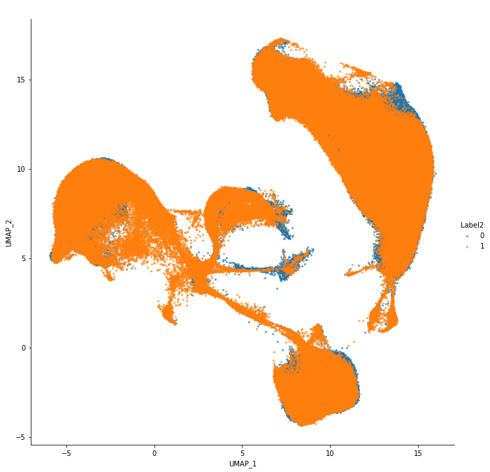

# Human Cell Atlas Tutorial

### iMAP workflow

In this tutorial, we will show the entire iMAP pipeline using the 'Human cell atlas' dataset. This is a large dataset with 321,463 bone marrow cells in batch 1 and 300,003 cord blood-derived cells in batch 2. And we will use this dataset to measure iMAP's ability to handle big data and measure the time consumed by each part of the processure.

The total workfow includes: 
<ol>
    <li>Loading and preprocessing data;</li>
    <li>Running the main iMAP two-stage batch effect removal procedure;</li>
    <li>(Optional) Visulizations; </li>
</ol>


```python
#### IMPORT LIBRARY ####
import datetime
import numpy as np
import scanpy as sc
import imap
```

#### 1. Loading and preprocessing data

The 'Human cell atlas' dataset is already stored at <a href=''><font color='blue'>'../other_data/ica_cord_blood_h5.h5'</font></a> and <a href=''><font color='blue'>'../other_data/ica_bone_marrow_h5.h5'</font></a>. We use the scanpy API `read_10x_h5` to read the file and store as an 'AnnData' object. Here we record the time it takes to import the data, which on our computer is usually around 18s.


```python
starttime = datetime.datetime.now()
adata1 = sc.read_10x_h5('../other_data/ica_cord_blood_h5.h5')
adata2 = sc.read_10x_h5('../other_data/ica_bone_marrow_h5.h5')
endtime = datetime.datetime.now()
print((endtime-starttime).seconds)
```

**Preprocessing:** Here we record the time it takes to preprocess the data, which on our computer is usually around 110s. And we acquire 656258 cells with 1615 highly variable genes.


```python
starttime = datetime.datetime.now()
genes = sorted(list(set(adata1.var_names)))
index_ = list(adata1.var_names)
adata1 = adata1[:, [index_.index(gene) for gene in genes]]
genes = sorted(list(set(adata2.var_names)))
index_ = list(adata2.var_names)
adata2 = adata2[:, [index_.index(gene) for gene in genes]]
adata = adata1.concatenate(adata2)
adata = imap.stage1.data_preprocess(adata, 'batch')  #Preprocess the data.
adata.obs['batch'] = np.array([str(item) for item in adata.obs['batch']])
adata.X = adata.X.toarray()
endtime = datetime.datetime.now()
print((endtime-starttime).seconds)
print(adata)  #Output the basic information of the preprocessed data.
```

#### 2. Batch effect removal by iMAP

See <font color='red'>Cell Line Tutorial</font> for details on the usage of `iMAP_fast` and `integrate_data`.

To verify that the iMAP calculation time is not sensitive to the number of cells, we set the same parameters that we used to process the 'Tabula Muris' dataset. (See main text (Fig. 3e) for the time cost of iMAP versus the number of cells by downsampling from 500 to 100,000 cells of Tabula Muris.)

Here we record the time that two iMAP's stages cost, which on our computer is usually around 198s.


```python
starttime = datetime.datetime.now()

### Stage I
EC, ec_data = imap.stage1.iMAP_fast(adata, key="batch", n_epochs=150) 
### Stage II
output_results = imap.stage2.integrate_data(adata, ec_data, n_epochs=100)

endtime = datetime.datetime.now()
print((endtime-starttime).seconds)
```

#### 3. Visualizations

**Visualizations for the final output results**:The results are saved in './pic/' directory. 
    
Due to the large number of cells in 'human cell atlas' dataset. The cost of time is usually around 1710s.


```python
import os
import numpy as np
import pandas as pd
import seaborn as sns
from sklearn.decomposition import PCA
import matplotlib.pyplot as plt
import umap

#### UMAP ####
def data2umap(data, n_pca=0):
    if n_pca > 0:
        pca = PCA(n_components=n_pca)
        embedding = pca.fit_transform(data)
    else:
        embedding = data
    embedding_ = umap.UMAP(
        n_neighbors=30,
        min_dist=0.3,
        metric='cosine',
        n_components = 2,
        learning_rate = 1.0,
        spread = 1.0,
        set_op_mix_ratio = 1.0,
        local_connectivity = 1,
        repulsion_strength = 1,
        negative_sample_rate = 5,
        angular_rp_forest = False,
        verbose = False
    ).fit_transform(embedding)
    return embedding_
def umap_plot(data, hue, title, save_path):
    import seaborn as sns
    fig = sns.lmplot(
        x = 'UMAP_1',
        y = 'UMAP_2',
        data = data,
        fit_reg = False,
        legend = True,
        size = 9,
        hue = hue,
        scatter_kws = {'s':4, "alpha":0.6}
    )
    plt.title(title, weight='bold').set_fontsize('20')
    fig.savefig(save_path)
    plt.close()
def gplot(embedding_, batch_info, celltype_info, filename):
    test = pd.DataFrame(embedding_, columns=['UMAP_1', 'UMAP_2'])
    test['Label1'] = batch_info
    test['Label2'] = celltype_info
    title = f' '
    for i in range(1,3):
        hue = f'Label{i}'
        save_path = './pic/'+filename + f'{i}.png'
        umap_plot(test, hue, title, save_path)
```


```python
starttime = datetime.datetime.now()
embedding_ = data2umap(output_results, n_pca=30)
gplot(embedding_, np.array(adata.obs['batch']), np.array(adata.obs['batch']), 'human_cell_atlas_G_')
endtime = datetime.datetime.now()
print((endtime-starttime).seconds)
```

<center class="half">
    
</center>


```python

```
